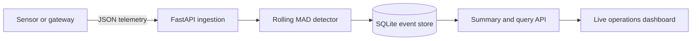

# SensorWatch

[](https://github.com/amkumirab/SensorWatch/actions/workflows/tests.yml)
[](https://www.python.org/)
[](LICENSE)

SensorWatch is a compact industrial telemetry MVP. It accepts sensor readings through a
FastAPI service, stores them in SQLite, builds an independent rolling baseline for every
sensor/metric pair, and flags unusual values in a live monitoring dashboard.

The detector uses the median and median absolute deviation (MAD), making it more robust to
spikes than a mean and standard-deviation baseline. Every decision includes an anomaly score,
baseline center, and baseline scale so the result remains explainable.

> **Project status:** Portfolio MVP. It demonstrates ingestion, online detection, persistence,
> API design, testing, and containerization; it is not a certified industrial alarm system.

## Features

- Single and batch telemetry ingestion
- Independent rolling baselines per sensor and metric
- Robust MAD anomaly scoring with warm-up state
- Persistent SQLite event store
- Summary, fleet, telemetry, and anomaly APIs
- Responsive dependency-free monitoring dashboard
- Deterministic three-sensor demo-data generator
- OpenAPI documentation at `/docs`
- Unit and API integration tests
- Docker and GitHub Actions configuration

## Architecture



For each reading, SensorWatch loads the most recent values from the same sensor/metric series.
It waits for a configurable warm-up period, calculates a robust baseline, persists the decision,
and returns the anomaly metadata in the ingestion response.

## Quick start

Requirements: Python 3.10 or newer.

Windows PowerShell:

```powershell
py -m venv .venv
.venv\Scripts\Activate.ps1
python -m pip install -e ".[dev]"
sensorwatch
```

macOS or Linux:

```bash
python -m venv .venv
source .venv/bin/activate
python -m pip install -e ".[dev]"
sensorwatch
```

Open <http://127.0.0.1:8000>. Press **Generate demo data** to create temperature,
vibration, and pressure telemetry with a few injected faults.

## Run with Docker

```bash
docker compose up --build
```

The named Docker volume preserves the SQLite database between container restarts.

## Send a reading

```bash
curl -X POST http://127.0.0.1:8000/api/v1/readings \
  -H "Content-Type: application/json" \
  -d '{
    "sensor_id": "boiler-01",
    "metric": "temperature",
    "value": 72.4,
    "unit": "C"
  }'
```

Example response:

```json
{
  "id": 1,
  "sensor_id": "boiler-01",
  "metric": "temperature",
  "value": 72.4,
  "unit": "C",
  "recorded_at": "2026-08-14T08:30:00Z",
  "anomaly_score": 0.0,
  "is_anomaly": false,
  "detector_status": "warming-up",
  "baseline_center": null,
  "baseline_scale": null
}
```

See the interactive OpenAPI page for batch ingestion and query filters:
<http://127.0.0.1:8000/docs>.

## Detector configuration

Copy `.env.example` or set environment variables before starting the service.

| Variable | Default | Purpose |
|---|---:|---|
| `SENSORWATCH_DATABASE_URL` | `sqlite:///./data/sensorwatch.db` | SQLAlchemy database URL |
| `SENSORWATCH_DETECTOR_WINDOW` | `40` | Recent samples in each baseline |
| `SENSORWATCH_DETECTOR_MIN_SAMPLES` | `12` | Warm-up samples before classification |
| `SENSORWATCH_DETECTOR_THRESHOLD` | `3.5` | Minimum robust score for an anomaly |
| `SENSORWATCH_DEMO_ENABLED` | `true` | Enable the demo-data endpoint |

## Development

```bash
ruff check .
pytest --cov=sensorwatch --cov-report=term-missing
```

## API overview

| Method | Path | Purpose |
|---|---|---|
| `POST` | `/api/v1/readings` | Ingest one reading |
| `POST` | `/api/v1/readings/batch` | Ingest up to 500 readings atomically |
| `GET` | `/api/v1/readings` | Query telemetry and anomalies |
| `GET` | `/api/v1/summary` | Retrieve operational totals |
| `GET` | `/api/v1/sensors` | List sensor/metric series |
| `POST` | `/api/v1/demo/generate` | Generate reproducible demo telemetry |
| `GET` | `/health` | Database-backed health check |

## Production roadmap

- PostgreSQL/TimescaleDB storage and schema migrations
- Redis Streams or Kafka ingestion workers
- Device authentication and per-tenant access control
- Alert rules, acknowledgements, and escalation policies
- Prometheus metrics and OpenTelemetry traces
- Drift detection and scheduled model retraining
- WebSocket updates rather than dashboard polling

## Limitations

- The MVP runs detection inline with ingestion.
- A late historical reading is scored against the latest stored baseline.
- SQLite is appropriate for a local demonstration, not high-volume concurrent ingestion.
- The demo endpoint should be disabled in a public production deployment.
- Thresholds are global; production equipment normally needs per-series configuration.

## Contributing

Bug reports, focused pull requests, and discussions about detector behavior are welcome. Read
[CONTRIBUTING.md](CONTRIBUTING.md) before submitting a change. Security reports should follow
the private process described in [SECURITY.md](SECURITY.md).

## Author

Created and maintained by
[AmirAli Mirabzadeh Ardekani](https://github.com/amkumirab).

## License

[MIT](LICENSE)
