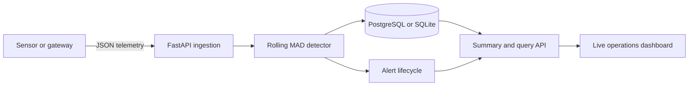

# SensorWatch

[](https://github.com/amkumirab/SensorWatch/actions/workflows/tests.yml)
[](https://www.python.org/)
[](LICENSE)

SensorWatch is a compact industrial telemetry MVP. It accepts sensor readings through a
FastAPI service, stores them in PostgreSQL or SQLite, builds an independent rolling baseline
for every sensor/metric pair, and flags unusual values in a live monitoring dashboard.

The detector uses the median and median absolute deviation (MAD), making it more robust to
spikes than a mean and standard-deviation baseline. Every decision includes an anomaly score,
baseline center, and baseline scale so the result remains explainable.

> **Project status:** Portfolio MVP. It demonstrates ingestion, online detection, persistence,
> API design, testing, and containerization; it is not a certified industrial alarm system.

## Features

- Single and batch telemetry ingestion
- Independent rolling baselines per sensor and metric
- Robust MAD anomaly scoring with warm-up state
- PostgreSQL and SQLite persistence managed with Alembic migrations
- Transactional alert creation with acknowledge and resolve workflows
- Summary, fleet, telemetry, and anomaly APIs
- Responsive dependency-free monitoring dashboard
- Deterministic three-sensor demo-data generator
- OpenAPI documentation at `/docs`
- Unit and API integration tests
- Docker and GitHub Actions configuration

## Architecture



For each reading, SensorWatch loads the most recent values from the same sensor/metric series.
It waits for a configurable warm-up period, calculates a robust baseline, persists the decision,
and returns the anomaly metadata in the ingestion response.

## Quick start

Requirements: Python 3.10 or newer.

Windows PowerShell:

```powershell
py -m venv .venv
.venv\Scripts\Activate.ps1
python -m pip install -e ".[dev]"
sensorwatch migrate
sensorwatch
```

macOS or Linux:

```bash
python -m venv .venv
source .venv/bin/activate
python -m pip install -e ".[dev]"
sensorwatch migrate
sensorwatch
```

Open <http://127.0.0.1:8000>. Press **Generate demo data** to create temperature,
vibration, and pressure telemetry with a few injected faults.

The local default is SQLite, which keeps the quick start self-contained. Database changes are
applied through Alembic before the service starts.

## Run with Docker and PostgreSQL

```bash
docker compose up --build
```

Docker Compose starts PostgreSQL, waits for its health check, applies all migrations, and then
starts SensorWatch. The named PostgreSQL volume preserves telemetry between container restarts.
The default credentials are intended for local development; override them in a local `.env`
file before using the stack outside a development machine.

## Database migrations

Apply every pending migration to the database selected by `SENSORWATCH_DATABASE_URL`:

```bash
sensorwatch migrate
```

The command accepts SQLite, `postgresql://`, `postgres://`, and explicit
`postgresql+psycopg://` URLs. Common hosted PostgreSQL URL formats are normalized to the
psycopg 3 driver automatically.

To create a migration after changing the SQLAlchemy models:

```bash
alembic revision --autogenerate -m "Describe the schema change"
alembic upgrade head
```

The initial migration creates the telemetry table and all query indexes. Migration behavior is
tested against SQLite on every supported Python version and against a real PostgreSQL service
in GitHub Actions.

## Alert workflow

Every anomalous reading creates one alert in the same database transaction. Alerts start in
the `open` state, must be acknowledged by an operator, and can then be resolved. Repeating the
same action is safe, while an invalid state transition returns HTTP `409 Conflict`.

Severity is derived from the anomaly score: readings at least twice the configured detector
threshold are `critical`; other anomalies are `warning`. The dashboard shows active alerts and
lets an operator acknowledge or resolve them without leaving the monitoring view.

## Send a reading

```bash
curl -X POST http://127.0.0.1:8000/api/v1/readings \
  -H "Content-Type: application/json" \
  -d '{
    "sensor_id": "boiler-01",
    "metric": "temperature",
    "value": 72.4,
    "unit": "C"
  }'
```

Example response:

```json
{
  "id": 1,
  "sensor_id": "boiler-01",
  "metric": "temperature",
  "value": 72.4,
  "unit": "C",
  "recorded_at": "2026-08-14T08:30:00Z",
  "anomaly_score": 0.0,
  "is_anomaly": false,
  "detector_status": "warming-up",
  "baseline_center": null,
  "baseline_scale": null
}
```

See the interactive OpenAPI page for batch ingestion and query filters:
<http://127.0.0.1:8000/docs>.

## Detector configuration

Copy `.env.example` or set environment variables before starting the service.

| Variable | Default | Purpose |
|---|---:|---|
| `SENSORWATCH_DATABASE_URL` | `sqlite:///./data/sensorwatch.db` | SQLAlchemy database URL |
| `SENSORWATCH_DETECTOR_WINDOW` | `40` | Recent samples in each baseline |
| `SENSORWATCH_DETECTOR_MIN_SAMPLES` | `12` | Warm-up samples before classification |
| `SENSORWATCH_DETECTOR_THRESHOLD` | `3.5` | Minimum robust score for an anomaly |
| `SENSORWATCH_DEMO_ENABLED` | `true` | Enable the demo-data endpoint |

## Development

```bash
ruff check .
pytest --cov=sensorwatch --cov-report=term-missing
```

Install PostgreSQL support for development with:

```bash
python -m pip install -e ".[dev,postgres]"
```

## API overview

| Method | Path | Purpose |
|---|---|---|
| `POST` | `/api/v1/readings` | Ingest one reading |
| `POST` | `/api/v1/readings/batch` | Ingest up to 500 readings atomically |
| `GET` | `/api/v1/readings` | Query telemetry and anomalies |
| `GET` | `/api/v1/summary` | Retrieve operational totals |
| `GET` | `/api/v1/sensors` | List sensor/metric series |
| `GET` | `/api/v1/alerts` | Query alerts by state or severity |
| `POST` | `/api/v1/alerts/{id}/acknowledge` | Acknowledge an open alert |
| `POST` | `/api/v1/alerts/{id}/resolve` | Resolve an acknowledged alert |
| `POST` | `/api/v1/demo/generate` | Generate reproducible demo telemetry |
| `GET` | `/health` | Database-backed health check |

## Production roadmap

- Optional TimescaleDB hypertables for long-running telemetry stores
- Redis Streams or Kafka ingestion workers
- Device authentication and per-tenant access control
- Configurable alert rules and escalation policies
- Prometheus metrics and OpenTelemetry traces
- Drift detection and scheduled model retraining
- WebSocket updates rather than dashboard polling

## Limitations

- The MVP runs detection inline with ingestion.
- A late historical reading is scored against the latest stored baseline.
- SQLite remains useful for a local demonstration; PostgreSQL is recommended for concurrent
  ingestion and container deployments.
- The demo endpoint should be disabled in a public production deployment.
- Thresholds are global; production equipment normally needs per-series configuration.

## Contributing

Bug reports, focused pull requests, and discussions about detector behavior are welcome. Read
[CONTRIBUTING.md](CONTRIBUTING.md) before submitting a change. Security reports should follow
the private process described in [SECURITY.md](SECURITY.md).

## Author

Created and maintained by
[AmirAli Mirabzadeh Ardekani](https://github.com/amkumirab).

## License

[MIT](LICENSE)
